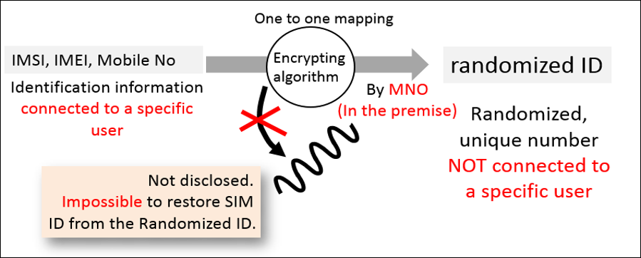
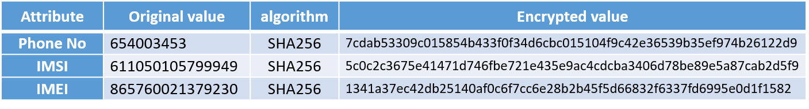

# Anonymization Tool
A tool for Anonymizing identifiable value in Data such as IMEI,IMSI, Mobile No.



**Example of data after anonymization**



## Prerequisites
Java JDK 8 or higher

## Usage

1. Put input data in input folder
2. Modify data format in config.json 
3. Run command 

    **For Windows**, navigate to software directory and run command "run.bat"
    ```
    java -classpath .;lib/* jp.utokyo.shibalab.csvanonymization.AnonymizationMain config.json
    ```
    **For Unix-based OS (Linux, Mac)**, open terminal navigate to software directory and run command "run.sh"
    ```
    java -classpath .:lib/* jp.utokyo.shibalab.csvanonymization.AnonymizationMain config.json
    ```


## Configuration (config.json)
```
{
"name":"configuration File for ARPT",
"threadNum":4,
"seedPath":"./salt.txt",
"streachNum":10,

"inputDirPath" :"./input",
"inputHeader":"true",
"inputDelim":",",

"outputDirPath":"./output",
"outputHeader":"false",
"outputDelim":",",

"layout":[
	{"inputNo":1,   "outputNo":1,   "name":"IMEI_Caller",         "anonymize":"true"},
	{"inputNo":2,   "outputNo":2,   "name":"IMSI_Caller",         "anonymize":"true"},
	{"inputNo":3,   "outputNo":3,   "name":"Call_Start",          "anonymize":"false"},
	{"inputNo":4,   "outputNo":4,   "name":"Call_Duration",       "anonymize":"false"},
	{"inputNo":5,   "outputNo":5,   "name":"LAC_Caller",		  "anonymize":"false"},
	{"inputNo":6,   "outputNo":6,   "name":"CELL_ID_Celler",      "anonymize":"false"},
	{"inputNo":7,   "outputNo":7,   "name":"Activity_Type",       "anonymize":"false"}
 ]
}

```
