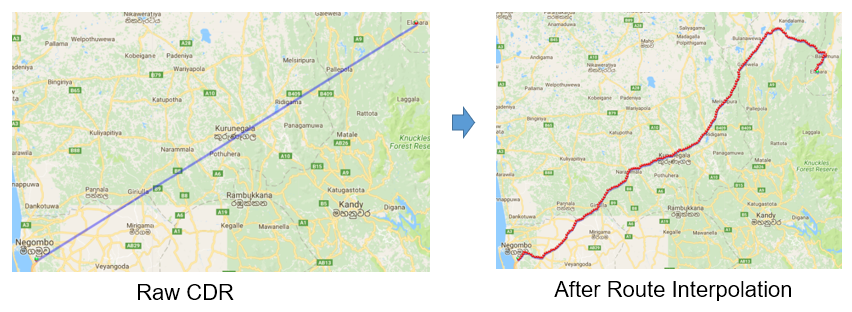
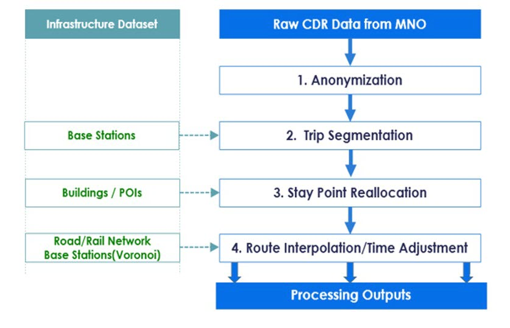

# CDR Interpolation
  A set of software for route interpolation including extracting stay points, extract tripsegment, relocation POI and route Interpolation with transpotation network. CDR data are generated according to the usage of mobile phone such making a call, sending SMS, use internet. Hence, there is no data when no activity with mobile phone and resulting in missing movement information during those period. The route interpolation help to recover those missing part by accommodate road network with interpolation technique.



## CDR Processing Procedure 


## Prerequisites
* Java JDK 8 or higher
* Building/POIs for Reallocation
* OSM road network data
* Voronoi data of Cell tower/Base Station location


## Usage
### Step 0: Prepare Input Data
* The input data must be in **CSV format**
* Header in the file is not allowed
* Support multiple files in the folder
* Input file must contain following attributes with the right order
    ```
    *ID           : Unique Identifier of each user
    *Time         : Activity Time (Start Time) in “YYYY-MM-DD HH:mm:ss” format 
    *Duration     : Call Duration in seconds
    *BaseID       : Unique Cell Tower ID (LAC+CellID)
    *Longitude    : Real decimal degree) in WGS84
    *Latitude     : Real Number(decimal degree) in WGS84
    IMEI          : International Mobile Equipment Identity (IMEI) of Caller
    IMSI          : International Mobile Subscriber Identity (IMSI) of Caller

    Remark : * = required field, 
           : Addition attributes after Latitude will not be used for the calculation.
    ```  
    ```
    ##Example##
    A59432230,2013-10-01 10:54:00,5,44786,80.6321761,7.478790558
    A59432230,2013-10-01 10:57:00,54,44786,80.6321761,7.478790558
    A59432230,2013-10-01 13:18:00,54,44786,80.6321761,7.478790558
    ``` 

### Step 1: Anoymization
* If the input contain privacy information such as IMEI, Phone Number and need to be anonymized before start analysis, please refer to Anonymization Tool. 
* See the link: [Anonymization Tool](/Anonymization)

### Step 2: Trip Segmentation
*  Open command prompt (cmd) and goto program path

    ```
    D:\> cd D:\git\CDR-analysis-tools-std\Interpolation
    D:\git\CDR-analysis-tools-std\Interpolation>
    ```
*  Run "tripsegmentation.bat $input". $input is the input folder

    ```
    D:\git\CDR-analysis-tools-std\Interpolation>tripsegmentation.bat input\

    ** All csv files in input folder will be processed **
    ```
*  Output files are located in output\tripsegment folder. File name will start with tripsegment_result and padding with original name of the input file. For the format of output file, please refer to **Output Format** section.

    ```
    Example:
    tripsegment_result_2013-10-01.csv
    tripsegment_result_2013-10-02.csv

    ```


### Step 3: Stay Point Reallocation
* ...

### Step 4: Route Interpolation
* ...


## Output Format
The format is same for trip segmentation and interpolation. the result are packed as trip data separated for each user and date. Output result contain 11 columns including user id, date, trip sequence, mobility type, transportation mode, total distance, total time, start time, end time, total points and point lists. Output are in CSV file (Comma-Separated Value). Explanation of each column is expressed as following. 

```
1. User Id
    •	Column name: UID
    •	Unique for each device
    •	Encrypted using Hash function, irreversible
2. Date
    •	Column name: DATE
    •	Date format: yyyy-MM-dd
    •	Example: 2015-12-31
3. Trip Sequence
    •	Column name: TRIP_SEQUENCE
    •	Order of sub trip in a day, start from 1
4. Mobility Type
    •	Column name: MOBILITY_TYPE
    •	Value: STAY or MOVE
5. Transportation Mode
    •	Column name: TRANSPORT_MODE
    •	Indicate mode of transportation of corresponding sub trip
    •	Value: STAY, WALK, CAR
6. Total Distance 
    •	Column name: TOTAL_DISTANCE
    •	Total travel distance of sub trip in meter
7. Total Time
    •	Column name: TOTAL_TIME
    •	Total travel time of sub trip in second
8. Start Time 
    •	Column name: START_TIME
    •	Indicate start time of sub trip
    •	Format: HH24:mm:ss
    •	Example: 23:20:00
9. End Time
    •	Column name: END_TIME
    •	Indicate end time of sub trip
    •	Format: HH24:mm:ss
    •	Example: 23:20:00
10. Total Points 
    •	Column name: TOTAL_POINTS
    •	Indicate total number of point data in sub trip
11. Point lists
    •	Column name: POINT_LISTS
    •	List of point data in sub trip
    •	Format: No.|time|latitude|longitude;
    •	No. is order number start from 1.
    •	Time: yyyy-MM-dd HH24:mm:ss
    •	Latitude and longitude in decimal format.
    •	Each point is separated by “;”
    •	Example: 1|2015-06-06 13:53:23|8.450733|-13.268241
  
```
Example
```
UID, DATE (yyyy-MM-dd), TRIP_SEQUENCE_ID, MOBILITY_TYPE, TRANSPORT_MODE, TOTAL_DISTANCE, TOTAL_TIME, START_TIME, END_TIME, TOTAL_POINTS, POINT_LIST
422a837717,2015-06-06,1,STAY,STAY,0.000,50003.000,00:00:00,13:53:23,1,1|2015-06-06 00:00:00|8.451033|-13.267844
422a837717,2015-06-06,2,MOVE,WALK,2775.678,2101.000,13:53:23,14:28:24,36,1|2015-06-06 13:53:23|8.450733|-13.268241;2|2015-06-06 13:54:23|8.451082|-13.268902;3|2015-06-06 13:55:23|8.451350|-13.269496;4|2015-06-06 13:56:23|8.451393|-13.270252;5|2015-06-06 13:57:23|8.451452|-13.271007;6|2015-06-06 13:58:23|8.451722|-13.271709;7|2015-06-06 13:59:23|8.451945|-13.272431;8|2015-06-06 14:00:23|8.452556|-13.272409;9|2015-06-06 14:01:23|8.453195|-13.272527;10|2015-06-06 14:02:23|8.453946|-13.272457;11|2015-06-06 14:03:23|8.454697|-13.272393;12|2015-06-06 14:04:23|8.455269|-13.272262;13|2015-06-06 14:05:23|8.454926|-13.271588;14|2015-06-06 14:06:23|8.454561|-13.270925;15|2015-06-06 14:07:23|8.454197|-13.270262;16|2015-06-06 14:08:23|8.453850|-13.269590;17|2015-06-06 14:09:23|8.453517|-13.268925;18|2015-06-06 14:10:23|8.453250|-13.268217;19|2015-06-06 14:11:23|8.453030|-13.267493;20|2015-06-06 14:12:23|8.452848|-13.266758;21|2015-06-06 14:13:23|8.452661|-13.266024;22|2015-06-06 14:14:23|8.452476|-13.265290;23|2015-06-06 14:15:23|8.452289|-13.264556;24|2015-06-06 14:16:23|8.452559|-13.264011;25|2015-06-06 14:17:23|8.453195|-13.263606;26|2015-06-06 14:18:23|8.453765|-13.263115;27|2015-06-06 14:19:23|8.454319|-13.262621;28|2015-06-06 14:20:23|8.454980|-13.262256;29|2015-06-06 14:21:23|8.455488|-13.261705;30|2015-06-06 14:22:23|8.456012|-13.261521;31|2015-06-06 14:23:23|8.456582|-13.261529;32|2015-06-06 14:24:23|8.457157|-13.261370;33|2015-06-06 14:25:23|8.457766|-13.261773;34|2015-06-06 14:26:23|8.458187|-13.262398;35|2015-06-06 14:27:23|8.458720|-13.261867;36|2015-06-06 14:28:24|8.459279|-13.261366
422a837717,2015-06-06,3,STAY,STAY,0.000,34295.000,14:28:24,23:59:59,1,1|2015-06-06 14:28:24|8.459106|-13.261265

```


## Author

* **Hiroshi KANASUGI** :  A project researcher at Center for Spatial Information Science, University of Tokyo.

* **Apichon WITAYANGKURN** :  A project assistant professor at Center for Spatial Information Science, University of Tokyo.

## License

Free to use

## Acknowledgments

* [Shibasaki Lab](https://shiba.iis.u-tokyo.ac.jp), The University of Tokyo
* [Center for Spatial Information Science](http://www.csis.u-tokyo.ac.jp/en/), The University of Tokyo


