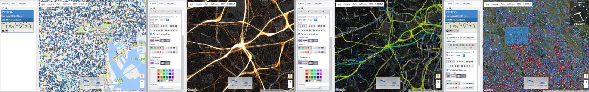
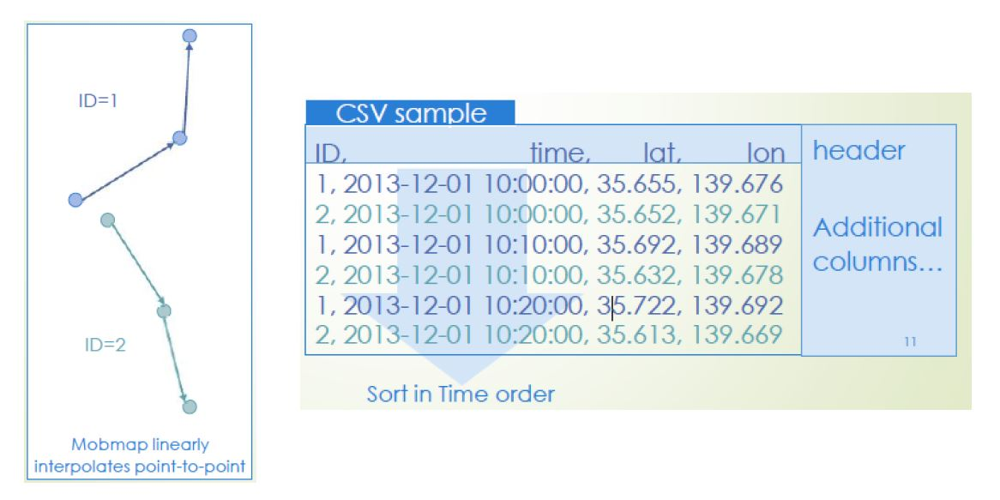

# Mobmap: Visualization and Analysis of Movement Data
An online tool for visualization and analysis of movement/trajectory data such as GPS/CDR. with its functionally, it supports color labeling, various maker style and data filter.  




## How it works
In principle,  [Mobmap](https://shiba.iis.u-tokyo.ac.jp/member/ueyama/mm/) is an online tool which can be accessed via web browser (Google Chrome). You can load input data in CSV format, then visualize on map with time-series movement, adjust marker style, change color with attribute, change basemap and apply data filter. 


## Usage

1. Access to [Mobmap](https://shiba.iis.u-tokyo.ac.jp/member/ueyama/mm/) Website and click "Lunch" button
2. Load input data in CSV format and selected columns correspond to the column definition.
3. Click “Start loading” to load CSV data
4. Click "Play" to start see movement data on map
5. Adjust parameters at your preference.


## Tutorial

Please access to the link to download tutorial file: [MobmapTutorial](MobmapTutorial.pdf)


## Input File (CSV)

* The inpurt file must be in CSV format with comma separated.
* File must contain at least the following attributes.
    ```
    Object ID : Positive Integer value
    Time      : “ hh:mm:ss ” or “YYYY MM DD hh:mm:ss ” format need to be sort in time order
    Latitude  : Real Number(decimal degree) in WGS84
    Longitude : Real decimal degree) in WGS84
    ```
* Columns don’t have to be fixed with the following order
* Additional columns are acceptable, e.g. transportation
* Header line can exclude at loading data



## Personal use

Mobmap is hosted on the web and loads base map from the internet. However, your own data will be loaded and processed on your local PC. Don't worry about data leakage, network traffic or server usage.

## Author
**Satoshi Ueyama** :  A project researcher at Center for Spatial Information Science, University of Tokyo, Japan until Oct. 2019, will be a researcher at LocationMind Inc. from Nov. 2019.
In 2019 he obtained his Ph.D. in Engineering from the University of Tokyo. And he is interested in utilizing visualization and computer graphics in the field of geographic information.


## License

Free to use

## Acknowledgments

* [Shibasaki Lab](https://shiba.iis.u-tokyo.ac.jp), The University of Tokyo
* [Center for Spatial Information Science](http://www.csis.u-tokyo.ac.jp/en/), The University of Tokyo

